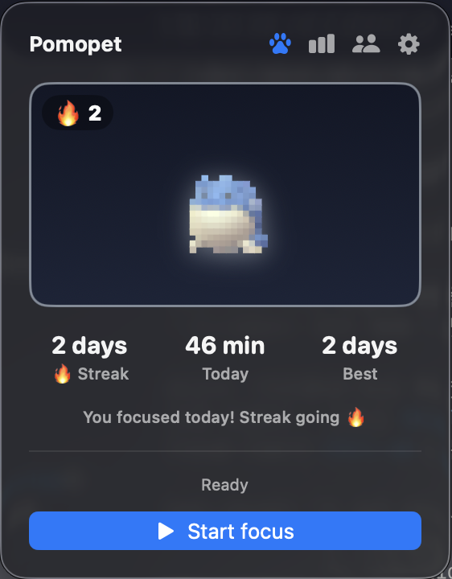
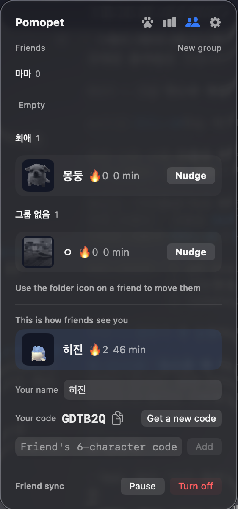
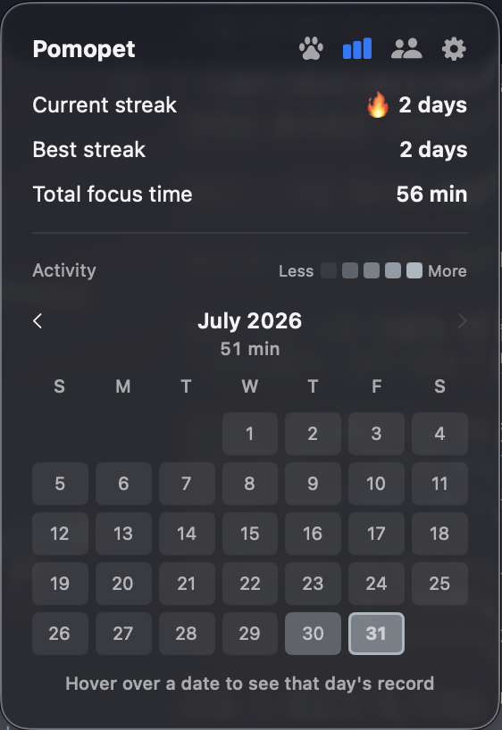
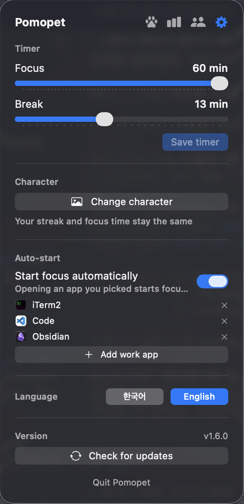
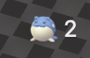
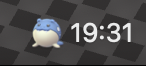

# 🐾 Pomopet

[한국어](README.md) · **English**

> **The character you upload** wakes up only when you study — a macOS menu bar Pomodoro timer.

Pomopet is a menu bar app that turns your favorite character image into **pixel art** and raises it.
Every time you focus with a Pomodoro session, your character wakes up and your streak grows.
Miss a day and your character falls asleep in grayscale — so **"don't let my character sleep"** becomes your motivation to study.

---

## 🆚 What makes it different from other pet Pomodoro apps

There are plenty of pet-raising Pomodoro apps. Pomopet differs in three ways.

1. **🖼️ Your uploaded image becomes the pet** — Instead of picking from built-in cats and dogs, you **upload your own favorite character** and raise it as pixel art. "Raising your favorite character right in your menu bar" — you'll only find that here.
2. **😴 It falls asleep if you don't show up** — Not just "active while focusing / asleep on breaks." **If you don't focus at all today, your character falls asleep in grayscale.** It's designed around loss aversion, like a Duolingo streak — the drive not to lose something you want to keep.
3. **🆓 Free · open source** — No payments, accounts, or subscriptions. All code is public.

> Plus milestone badges (BRONZE→DIAMOND) and an activity heatmap.

---

## 📸 Screenshots

| Character (awake) | Friends | Stats · heatmap | Settings |
|:---:|:---:|:---:|:---:|
|  |  |  |  |

### 🖥️ In the menu bar

Once it's running, it lives in your Mac's menu bar like this.

| Focused today (awake · streak) | Focusing / resting (time left) |
|:---:|:---:|
|  |  |

> Your uploaded character sits right in the menu bar. It stays grayscale and asleep until you focus today, then wakes up in full color with your streak beside it. During focus or a break it shows the time remaining.

---

## ✨ Features

- **🖼️ Upload your own character** — Drop in a favorite image and it's converted to pixel art for your pet
- **👀 Preview before you commit** — See how your photo looks as dots and in the menu bar first. Photos with a background can have it **removed automatically**
- **🔥 Streak** — Focus on any given day to keep the streak; skip a day and it resets
- **😴 Awake / Asleep** — Meet today's goal and your character wakes up in color and bounces; otherwise it sleeps in grayscale
- **🏅 Milestone aura** — A glowing border: 3-day streak BRONZE → 7 SILVER → 30 GOLD → 100 DIAMOND
- **🌱 Activity heatmap** — Your study record as a monthly calendar (browse months · hover a day for details)
- **🍅 Dead-simple Pomodoro** — Just two settings: focus and break. No goals to set
- **🪶 Lightweight** — Lives only in the menu bar (no Dock icon). All graphics are rendered in code, with no external images
- **🔄 Auto-update** — Installs new versions in-app automatically (via [Sparkle](https://sparkle-project.org); details in [Updates](#-updates))
- **👥 Grow together with friends** — Connect with a 6-character code to see whether your friends' pets are awake, and poke the sleeping ones. Off by default ([what is shared](#-friends-and-privacy))
- **▶️ Work app detection** — Open Xcode or VS Code and focus starts 3 seconds later (with time to decline). It also notices when you're already working in one
- **☕ Away detection** — If there's no input for 5 minutes during a session, Pomopet asks whether to stop, so idle time doesn't inflate your record
- **🌐 Korean · English** — Follows your system language, or switch it yourself with a button in Settings

---

## 📥 Install

> **Requirements: macOS 14 (Sonoma) or later** · Universal (Apple Silicon + Intel)

### Option 1. Homebrew (recommended)
```bash
brew install --cask kes02/pomopet/pomopet
```
The cask automatically removes the Gatekeeper quarantine attribute, so it runs right away.

### Option 2. Download the DMG directly
1. Download the latest `Pomopet-x.y.z.dmg` from [Releases](https://github.com/kes02/Pomopet/releases)
2. Open the dmg and drag **Pomopet.app** into **Applications**
3. On first launch — since it's an **unsigned build**, macOS blocks it (*"can't verify it's free of malware"*). **On macOS Sequoia (15) the old "right-click → Open" trick is gone.** Pass it one of two ways:
   - **Terminal** (fastest):
     ```bash
     xattr -dr com.apple.quarantine /Applications/Pomopet.app
     ```
   - or **System Settings → Privacy & Security** → scroll down → click **"Open Anyway"** next to "Pomopet was blocked" → launch again and confirm once more

> 💡 In the block dialog, **don't click "Move to Trash"** (it deletes the app) — click "Done" and use one of the methods above. This happens only because there's no Apple signature/notarization; it doesn't affect functionality, and you only need to do it **once**. (Installing via **Homebrew** above skips this entirely.)

### Option 3. Build from source (for developers)
```bash
git clone https://github.com/kes02/Pomopet.git
cd Pomopet
open Pomopet.xcodeproj   # ⌘R in Xcode
# or package a DMG directly:
bash scripts/package-dmg.sh 1.0.0   # → dist/Pomopet-1.0.0.dmg
```

#### Releasing (for maintainers)
```bash
scripts/release.sh 1.2.3   # build DMG → upload GitHub Release → update Homebrew cask (sha256)
```
> Re-generating the DMG changes its hash, so **the release builder is unified into this single script.**
> GitHub Actions (`ci.yml`) only checks that the build doesn't break.

---

## 🔄 Updates

**The app updates itself automatically** (powered by [Sparkle](https://sparkle-project.org) — download, install, and relaunch in one step).

- **In-app auto-update** — When a new version is out, Pomopet notifies you and, with your consent, installs and relaunches right inside the app. You can also check manually with **Check for updates** in Settings.
- **Homebrew users** — You can also update with `brew upgrade --cask pomopet`.

> Updates are verified with an EdDSA signature (tamper-proof even though the build is unsigned), and only version info is fetched (no personal data sent).

---

## 🚀 How to use

1. Click the menu bar icon → **choose a character image to raise**
   - A transparent-background PNG (cutout) looks best — only the character stands out.
2. **Start focus** → your character wakes up the moment you begin
3. Any focus recorded today keeps your **streak** going 🔥 (stop early and you still keep the minutes, as long as it was 5+)
4. Keep it up day after day to build your streak and heatmap

### Screen guide
| Button | Function |
|---|---|
| 🐾 | Go to the character screen (home) |
| 📊 | Stats · streak · activity heatmap |
| ⚙️ | Settings (focus/break, character, work app detection) |

### Settings
- **Focus** — Length of one session (5–60 min)
- **Break** — Rest time after a session (1–30 min)
- **Auto-start on work apps** — Focus begins 3 seconds after you open an app you picked
- **Change character** — Swapping the image keeps your streak intact
- **Language** — Switch between 한국어 / English instantly

> If there's no input for 5 minutes during a session, Pomopet asks whether to stop — so time away doesn't inflate your record.


---

## 👥 Friends and privacy

Friend sync is **off by default.** Nothing is sent anywhere until you turn it on.

Turning it on creates an anonymous account and gives you a 6-character code. No email, no password, no social login.

**What goes up**

| Item | Example |
|---|---|
| Name | Display only, typed by you |
| Today's focus minutes / completed sessions | `75`, `3` |
| Whether the pet woke up / streak | `true`, `12` |
| Whether you're focusing right now | `focusing` |
| Pet image | 26×26 PNG, only when it changes |

**What never goes up**

- Timestamped records of what you did when
- Which apps you opened — work app detection runs entirely on your Mac
- Friend groups — stored only on this Mac
- Raw IP addresses — used only to throttle signups, hashed and deleted after a day

The server lives in [`server/`](server/) in this repo. If you'd rather not trust mine, **run your own** and point the app at it. See [server/README.md](server/README.md).

> All the app receives from the server is numbers and one PNG. There is no path for it to receive and execute code, so even a fully compromised server cannot run anything on your Mac.

---

## 🛠️ Tech stack

- **SwiftUI** · `MenuBarExtra` (menu-bar-only app, no Dock icon)
- **SwiftData** — persists daily records and stats
- **Canvas** — pixel rendering without external images (`ImagePixelizer` converts an uploaded image into a color grid)
- **Sparkle** — in-app auto updates (EdDSA signature verification)
- **NSWorkspace** — work app detection (no permissions needed)
- **Vision** — removes the background from uploaded photos. Built into macOS, so it adds no app size and runs entirely on your Mac
- **Cloudflare Workers + D1** — friend sync server ([`server/`](server/), optional)

### Project structure
```
Pomopet/Sources/
├─ App/         App entry point (PomopetApp, menu bar label)
├─ Core/        Timer/streak (PomopetController), settings (TimerSettings),
│               store location (StoreLocation), language switching (Localization),
│               auto updates (UpdaterManager)
│   ├─ Friends/   Friend sync — networking, identity, pet cache, groups (off by default)
│   └─ AutoStart/ Work app detection (WorkAppWatcher), away detection (IdleWatcher)
├─ Models/      SwiftData models (DailyRecord, AppStats)
├─ Creatures/   Pixel rendering (CustomPet, CharacterView, PetMenuBarIcon),
│               background removal (BackgroundRemover)
└─ Views/       Screens (Popover, Stats/Settings, Friends, upload preview, prompt cards)

server/         Friend sync server (Cloudflare Workers + D1)
```

---

## ⚠️ About character images

The upload feature converts a **local image you choose yourself**, for personal use.
If you use someone else's work (characters, etc.), please keep it within personal use. This app bundles and distributes no character images.

---

## 📄 License

[MIT License](LICENSE) © 2026 kes02

> Applies to the app code only. Character images you upload remain the property of their respective copyright holders and are not covered by this license.
