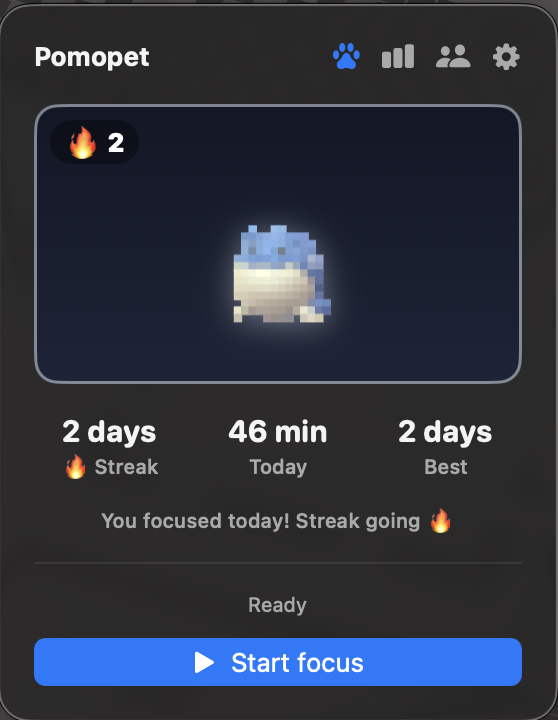
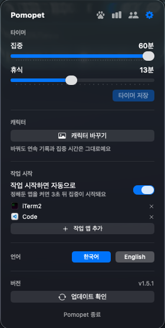
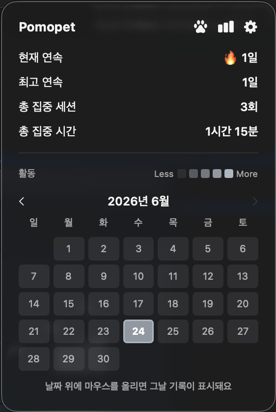
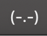

# 🐾 Pomopet

**한국어** · [English](README.en.md)

> **내가 올린 최애 캐릭터**가 내가 공부할 때만 깨어나는 macOS 메뉴바 포모도로 타이머

Pomopet은 좋아하는 캐릭터 이미지를 **픽셀로 변환**해 키우는 메뉴바 앱입니다.
포모도로로 집중할 때마다 캐릭터가 깨어나고, 연속 기록이 쌓입니다.
하루를 거르면 캐릭터가 잿빛으로 잠들기 때문에 — **"내 캐릭터를 재우지 말자"** 가 공부 동기가 됩니다.

---

## 🆚 다른 펫 포모도로 앱과 다른 점

펫 키우는 포모도로 앱은 많습니다. Pomopet은 세 가지가 다릅니다.

1. **🖼️ 내가 올린 이미지가 펫이 됩니다** — 빌트인 고양이·강아지 중 고르는 게 아니라, **좋아하는 캐릭터를 직접 업로드**해 도트로 키웁니다. "최애를 내 메뉴바에서 키운다"는 경험은 여기만 있습니다.
2. **😴 안 하면 잠듭니다** — 단순히 "집중할 때 활성 / 쉴 때 잠듦"이 아니라, **하루 목표를 못 채우면 캐릭터가 흑백으로 잠듭니다.** 듀오링고 스트릭처럼 *지키고 싶은 것을 잃지 않으려는* 동기로 설계했습니다.
3. **🆓 무료 · 오픈소스** — 결제·계정·구독 없음. 코드 전부 공개.

> 거기에 연속일 마일스톤 배지(BRONZE→DIAMOND)와 활동 잔디까지

---

## 📸 스크린샷

| 캐릭터 (활성화) | 설정 | 통계 · 잔디 |
|:---:|:---:|:---:|
|  |  |  |

### 🖥️ 메뉴바 모습

실행하면 맥 상단 메뉴바에 이렇게 떠 있습니다.

| 오늘 0세션 (잠듦) | 오늘 집중함 (깨어남) | 집중·휴식 중 |
|:---:|:---:|:---:|
|  |  |  |

> 오늘 한 번도 집중 안 하면 `(-.-)`로 잠들어 있다가, 한 세션이라도 하면 `(•ᴗ•)`로 깨어납니다. 집중·휴식 중엔 남은 시간이 표시돼요.

---

## ✨ 특징

- **🖼️ 내 캐릭터 업로드** — 좋아하는 이미지를 올리면 도트로 변환해 펫으로 사용
- **🔥 연속 기록(스트릭)** — 매일 목표를 채우면 연속일이 쌓이고, 끊기면 리셋
- **😴 활성/잠듦** — 오늘 목표 달성 시 캐릭터가 컬러로 깨어나 통통 튐 / 안 하면 흑백으로 잠듦
- **🏅 마일스톤 아우라** — 연속 3일 BRONZE → 7일 SILVER → 30일 GOLD → 100일 DIAMOND 테두리
- **🌱 활동 히트맵** — 월 달력으로 공부 기록을 한눈에 (월 이동 · 날짜 hover로 그날 상세)
- **🎯 하루 목표** — 하루에 몇 세션을 채워야 "활성화"되는지 설정 (1~20)
- **🍅 단순한 포모도로** — 집중 / 휴식 / 하루 목표 세 가지만 설정하면 끝
- **🪶 가벼움** — Dock 아이콘 없이 메뉴바에만 존재. 모든 그래픽은 외부 이미지 없이 코드로 렌더링
- **🔄 자동 업데이트** — 새 버전을 앱 안에서 자동 설치 (Sparkle, 자세히는 [업데이트](#-업데이트))
- **👥 친구와 같이 키우기** — 6자리 코드로 연결해 친구 펫이 깨어 있는지 확인하고, 잠들어 있으면 쿡 찌르기 (기본 꺼짐 · [무엇이 오가나](#-친구-연동과-개인정보))
- **▶️ 작업 앱 감지** — 정해둔 앱(Xcode, VS Code 등)을 켜면 "집중 시작할까요?" 하고 물어봄
- **☕ 자리 비움 감지** — 집중 중 5분 넘게 입력이 없으면 중지할지 물어봐 기록이 부풀지 않게
- **🌐 한국어 · English** — 시스템 언어를 따르거나, 설정에서 버튼으로 직접 전환

---

## 📥 설치

> **요구 사항: macOS 14 (Sonoma) 이상** · Apple Silicon + Intel 모두 지원(유니버설)

### 방법 1. Homebrew (추천)
```bash
brew install --cask kes02/pomopet/pomopet
```
cask가 Gatekeeper 격리 속성을 자동으로 제거해 바로 실행됩니다.

### 방법 2. DMG 직접 다운로드
1. [Releases](https://github.com/kes02/Pomopet/releases)에서 최신 `Pomopet-x.y.z.dmg` 다운로드
2. dmg를 열고 **Pomopet.app**을 **Applications**로 드래그
3. 처음 실행 시 — **미서명 빌드**라 macOS가 *"악성 코드가 없음을 확인할 수 없습니다"* 라며 막습니다. **macOS Sequoia(15)부터는 "우클릭 → 열기" 우회가 사라졌어요.** 둘 중 하나로 통과:
   - **터미널** (가장 빠름):
     ```bash
     xattr -dr com.apple.quarantine /Applications/Pomopet.app
     ```
   - 또는 **시스템 설정 → 개인정보 보호 및 보안** → 아래로 스크롤 → "Pomopet이(가) 차단됨" 옆 **"그래도 열기"** → 다시 실행 후 한 번 더 확인

> 💡 차단 다이얼로그에서 **"휴지통으로 이동"을 누르지 마세요**(앱이 삭제됩니다) — "완료"를 누르고 위 방법으로 여세요. Apple 서명/공증이 없어 생기는 일이며 기능엔 지장이 없고, **최초 1회만** 필요합니다. (위 **Homebrew**로 설치하면 이 과정 자체가 필요 없어요.)

### 방법 3. 소스에서 빌드 (개발자용)
```bash
git clone https://github.com/kes02/Pomopet.git
cd Pomopet
open Pomopet.xcodeproj   # Xcode에서 ⌘R
# 또는 DMG 직접 패키징:
bash scripts/package-dmg.sh 1.0.0   # → dist/Pomopet-1.0.0.dmg
```

#### 릴리스 (메인테이너용)
```bash
scripts/release.sh 1.2.3   # DMG 빌드 → GitHub Release 업로드 → Homebrew cask(sha256) 갱신
```
> DMG는 재생성 시 해시가 바뀌므로 **릴리스 빌더는 이 스크립트 하나로 일원화**합니다.
> GitHub Actions(`ci.yml`)는 빌드가 깨지지 않는지 확인하는 체크 전용입니다.

---

## 🔄 업데이트

**앱이 새 버전을 자동으로 업데이트**합니다 ([Sparkle](https://sparkle-project.org) 기반 — 다운로드·설치·재시작까지 한 번에).

- **인앱 자동 업데이트** — 새 버전이 나오면 Pomopet이 알려주고, 동의하면 앱 안에서 바로 설치·재시작합니다. 설정 화면의 **업데이트 확인**으로 수동 확인도 가능.
- **Homebrew 사용자** — `brew upgrade --cask pomopet` 로도 받을 수 있습니다.

> 업데이트는 EdDSA 서명으로 검증되며(미서명 빌드여도 위·변조 방지), 버전 정보만 조회합니다(개인정보 전송 없음).

---

## 🚀 사용법

1. 메뉴바 아이콘 클릭 → **키울 캐릭터 이미지 선택**
   - 투명 배경 PNG(누끼)를 넣으면 캐릭터만 또렷하게 떠서 가장 예쁩니다.
2. **집중 시작** → 타이머가 끝나면 한 세션 완료
3. 오늘 **하루 목표**만큼 세션을 채우면 캐릭터가 **활성화**(컬러로 깨어남) 🔥
4. 매일 이어가면 연속 기록과 잔디가 쌓입니다

### 화면 안내
| 버튼 | 기능 |
|---|---|
| 🐾 | 캐릭터 화면(홈)으로 |
| 📊 | 통계 · 연속 기록 · 활동 잔디 |
| 👥 | 친구 — 친구 펫·진행 상황, 쿡 찌르기 |
| ⚙️ | 설정 |

### 설정
- **집중** — 한 세션 길이 (5~60분)
- **휴식** — 세션 후 쉬는 시간 (1~30분)
- **하루 목표** — 활성화에 필요한 하루 세션 수 (1~20)
- **캐릭터 바꾸기** — 이미지를 교체해도 연속 기록은 그대로 유지
- **작업 시작하면 물어보기** — 정해둔 앱을 켜면 집중 시작을 권함 (기본 꺼짐)
- **언어** — 한국어 / English 버튼으로 즉시 전환

> 하루 목표를 도중에 바꿔도, 이미 오늘 달성했다면 캐릭터는 잠들지 않고 연속 기록도 유지됩니다.


---

## 👥 친구 연동과 개인정보

친구 연동은 **기본으로 꺼져 있습니다.** 켜기 전에는 서버로 아무것도 보내지 않습니다.

켜면 익명 계정이 하나 만들어지고 6자리 코드를 받습니다. 이메일도 비밀번호도 소셜 로그인도 없습니다.

**올라가는 것**

| 항목 | 예 |
|---|---|
| 이름 | 표시용, 직접 입력 |
| 오늘 집중 시간 · 세션 수 · 목표 | `75분`, `3`, `5` |
| 펫이 깨어났는지 · 연속일 | `true`, `12` |
| 지금 집중 중인지 | `focusing` |
| 펫 그림 | 26×26 PNG, 바뀔 때만 |

**올라가지 않는 것**

- 몇 시에 무엇을 했는지 같은 시각별 기록
- 어떤 앱을 켰는지 — 작업 앱 감지는 전부 맥 안에서만 돌아갑니다
- 친구 그룹 — 이 맥에만 저장됩니다
- 원본 IP — 가입 도배를 막는 데만 쓰고 해시로 바꿔 하루 뒤 지웁니다

서버는 [`server/`](server/)에 함께 공개돼 있고, 못 믿겠으면 **직접 띄워서** 앱 설정에 그 주소를 넣으면 됩니다. 자세한 내용은 [server/README.md](server/README.md)를 보세요.

> 앱이 서버에서 받는 건 숫자와 PNG 한 장뿐입니다. 코드를 받아 실행하는 경로가 없어서, 서버가 완전히 장악당해도 사용자 맥에서 뭔가를 실행시킬 수는 없습니다.

---

## 🛠️ 기술 스택

- **SwiftUI** · `MenuBarExtra` (메뉴바 전용 앱)
- **SwiftData** — 일일 기록·통계 영구 저장
- **Canvas** — 외부 이미지 없이 도트 렌더링 (`ImagePixelizer`가 업로드 이미지를 색 격자로 변환)

### 프로젝트 구조
```
Pomopet/Sources/
├─ App/        앱 진입점 (PomopetApp, 메뉴바 라벨)
├─ Core/       타이머·스트릭 로직 (PomopetController), 설정 (TimerSettings), 업데이트 확인 (UpdateChecker)
├─ Models/     SwiftData 모델 (DailyRecord, AppStats)
├─ Creatures/  도트 렌더링 (CustomPet, CharacterView)
└─ Views/      화면 (PopoverView, Stats/Settings)
```

---

## ⚠️ 캐릭터 이미지에 대하여

업로드 기능은 **사용자가 직접 고른 로컬 이미지**를 변환하는 개인용 기능입니다.
타인의 저작물(캐릭터 등)을 넣어 쓰는 경우, 개인 사용 범위를 지켜 주세요. 이 앱은 어떤 캐릭터 이미지도 포함·배포하지 않습니다.

---

## 📄 라이선스

[MIT License](LICENSE) © 2026 kes02

> 앱 코드에 한해 적용됩니다. 사용자가 업로드하는 캐릭터 이미지는 각 저작권자에게 권리가 있으며, 본 라이선스 범위에 포함되지 않습니다.
